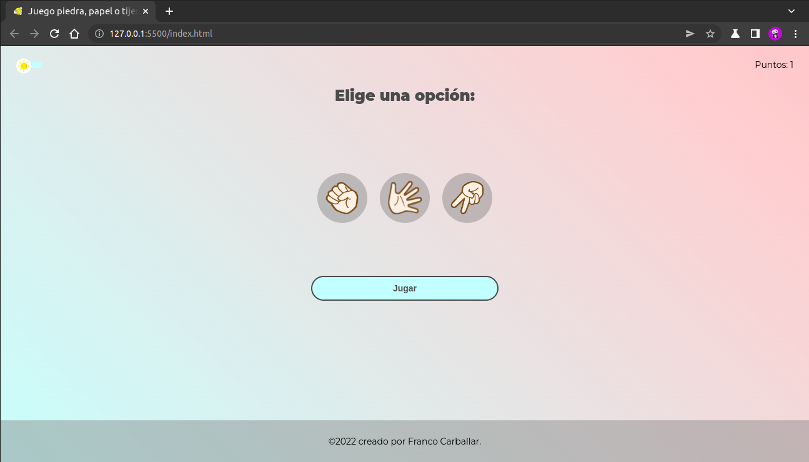
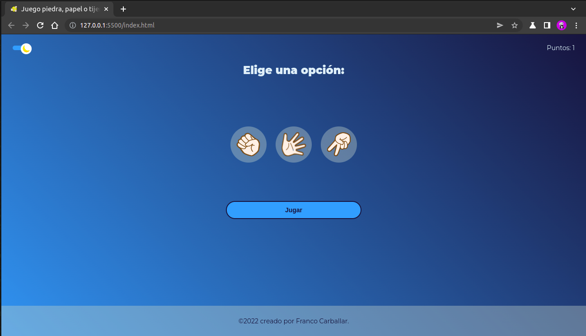
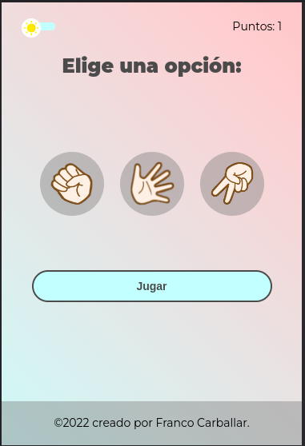
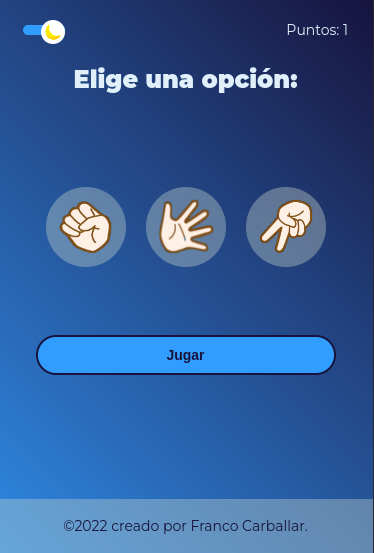

# Juego Piedra Papel o Tijera
Piedra, papel o tijera, conocido también como chin chan pu, pikachú, cachipún, jankenpón, yan ken po, pin pon papas, hakembó o how-are-you-speak, es un juego infantil, un juego de manos en el que existen tres elementos: la piedra que vence a la tijera rompiéndola, la tijera que vence al papel cortándolo y el papel que vence a la piedra envolviéndola, dando lugar a un círculo o ciclo cerrado, que caracteriza al juego.

## Ver está página:
https://francocarballar.github.io/Juego-Piedra-Papel-o-Tijera/

## Tecnologías utilizadas:
- HTML
- CSS
- Responsive Design (Siguiendo la metodología de Mobile First)
- JavaScript

## Funcionamiento:
Funciona de la siguiente manera: tienes que elegir una opción (eliges haciendo click sobre la opción) en este caso "piedra", "papel" o "tijera". Una vez elegida la opción con la que quieres jugar das un click en el butón que dice jugar.

Cuando jueges te va salir un resultado que te dice si "ganaste", "perdiste" o "empataste" y la opción de poder jugar otra vez.

Arriba a la izquierda hay un botón que cambia el "tema" del juego, es decir te muestra la interfaz de un color o de otro.

Por último, arriba a la derecha te sale el puntaje que tenés.
## Habilidades adquiridas: 
Aprendí a crear mi primer algoritmo, que en este caso es el que decide las reglas del juego. Me ayudo a desarrollar más mi pensamiento lógico.

## Imágenes:
- Desktop: 

- Desktop Dark Mode: 

- Mobile: 

- Mobile Dark Mode: 

### Creado por @francocarballar
